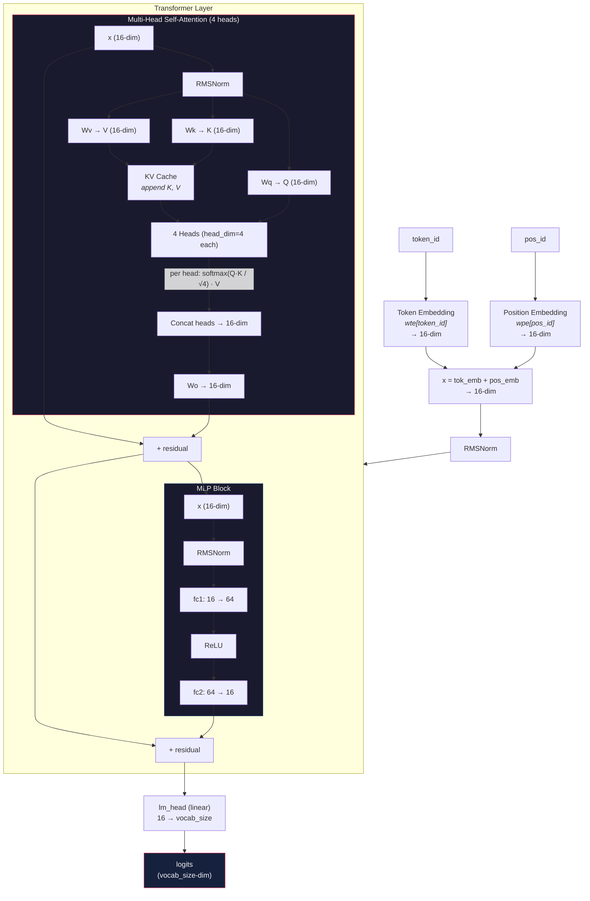

# microGPT Breakdown

Karpathy's `microgpt.py` is ~175 lines of pure Python that implements a complete GPT training pipeline with zero dependencies (no PyTorch, no numpy). It's the *algorithm itself*, stripped to its skeleton. Everything else in modern LLM training — CUDA kernels, mixed precision, distributed compute, FlashAttention — is optimization on top of these bones.

There are three core pieces: a **tokenizer**, a **model**, and a **training loop** (with loss computation and optimizer). Plus a small but critical autograd engine (`Value`) that makes backpropagation possible without a framework.

---

## 1. Tokenizer

**Lines 19-23** — Character-level tokenizer. No BPE, no SentencePiece, no tiktoken. Each unique character in the dataset gets an integer ID.

```python
uchars = sorted(set(''.join(docs)))  # unique characters → token ids 0..n-1
BOS = len(uchars)                    # special Beginning of Sequence token
vocab_size = len(uchars) + 1         # +1 for BOS
```

**What it does:**
- Collects every unique character across all documents and sorts them alphabetically
- Assigns each character an integer ID by its position in the sorted list
- Adds one special token: `BOS` (Beginning of Sequence), used to mark both the start and end of a document

**Encoding** (string → tokens) happens inline during training:
```python
tokens = [BOS] + [uchars.index(ch) for ch in doc] + [BOS]
```
The name `"alice"` becomes something like `[27, 0, 11, 8, 2, 4, 27]` — BOS, a, l, i, c, e, BOS.

**Decoding** (token → string) happens during inference:
```python
sample.append(uchars[token_id])
```

That's the whole tokenizer. In production GPTs, this is replaced by BPE (byte-pair encoding) with ~50k-100k+ subword tokens. The character-level approach here means the model has to learn spelling from scratch, but it keeps the code dead simple.

---

## 2. Model

The model is a GPT-2-style transformer. It maps a sequence of token IDs to logits (unnormalized probabilities) over what token comes next. There are three sub-parts: **parameters**, **building blocks**, and **the forward pass**.

### 2a. Parameters (Lines 64-79)

The "knowledge" of the model lives in matrices of `Value` objects (the autograd scalars):

```python
n_layer = 1        # number of transformer layers
n_embd = 16        # embedding dimension (width)
block_size = 16    # max context length
n_head = 4         # number of attention heads
head_dim = n_embd // n_head  # = 4 dimensions per head
```

The `state_dict` holds all learnable weight matrices:

| Key | Shape | Purpose |
|-----|-------|---------|
| `wte` | (vocab_size, 16) | Token embedding — maps each token ID to a 16-dim vector |
| `wpe` | (16, 16) | Position embedding — maps each position to a 16-dim vector |
| `layer{i}.attn_wq` | (16, 16) | Query projection for attention |
| `layer{i}.attn_wk` | (16, 16) | Key projection for attention |
| `layer{i}.attn_wv` | (16, 16) | Value projection for attention |
| `layer{i}.attn_wo` | (16, 16) | Output projection for attention |
| `layer{i}.mlp_fc1` | (64, 16) | MLP up-projection (16 → 64, i.e. 4x expansion) |
| `layer{i}.mlp_fc2` | (16, 64) | MLP down-projection (64 → 16) |
| `lm_head` | (vocab_size, 16) | Final projection from embedding space → vocab logits |

All weights are initialized from a Gaussian with std=0.08. No biases anywhere.

Total parameter count: all these matrices flattened into a single `params` list.

### 2b. Building Blocks (Lines 82-92)

Four tiny functions that the forward pass is built from:

```python
def linear(x, w):
    """Matrix-vector multiply. x is a vector, w is a matrix. Returns w @ x."""
    return [sum(wi * xi for wi, xi in zip(wo, x)) for wo in w]

def softmax(logits):
    """Numerically stable softmax. Subtracts max for stability, then exp/normalize."""
    max_val = max(val.data for val in logits)
    exps = [(val - max_val).exp() for val in logits]
    total = sum(exps)
    return [e / total for e in exps]

def rmsnorm(x):
    """RMSNorm (replaces LayerNorm from GPT-2). No learnable scale/bias."""
    ms = sum(xi * xi for xi in x) / len(x)
    scale = (ms + 1e-5) ** -0.5
    return [xi * scale for xi in x]
```

Plus `relu` (defined on the `Value` class) used as the activation in the MLP block. GPT-2 uses GeLU; this uses ReLU to keep things simple.

### 2c. Forward Pass — `gpt()` (Lines 93-127)

The `gpt` function processes **one token at a time** (not a whole sequence at once). It takes a token ID, a position ID, and mutable KV-cache lists, and returns logits over the vocabulary.



**Key details:**
- **KV-Cache**: Keys and values from previous positions are stored and reused. This is what makes autoregressive generation efficient — each new token only computes its own Q/K/V, but attends to all previous K/V pairs. The causal mask is implicit: at position `t`, the cache only contains positions `0..t`.
- **Residual connections**: The output of each sub-block (attention, MLP) is *added* to its input. This is critical for gradient flow in deep networks.
- **RMSNorm placement**: Applied before each sub-block (pre-norm style), plus once after the initial embedding sum.

---

## 3. Training Loop (with Loss and Optimizer)

### 3a. Autograd Engine — `Value` class (Lines 25-62)

Before we can train, we need gradients. The `Value` class is a scalar autograd engine — every number in the network is a `Value` that tracks:
- `data`: the actual float value (forward pass)
- `grad`: the gradient of the loss w.r.t. this value (backward pass)
- `_children`: what Values were used to compute this one
- `_local_grads`: the local partial derivatives (chain rule factors)

It supports `+`, `*`, `**`, `/`, `log`, `exp`, `relu` — each operation creates a new `Value` node and records the local gradient. Calling `.backward()` on the loss does a topological sort of the computation graph and propagates gradients backward via the chain rule:

```
child.grad += local_grad * parent.grad
```

This is the same thing PyTorch's `autograd` does, but for scalars instead of tensors.

### 3b. The Loop (Lines 132-160)

```python
num_steps = 1000
for step in range(num_steps):
```

Each step:

**1. Data preparation (lines 136-138)**
```python
doc = docs[step % len(docs)]                          # pick one document
tokens = [BOS] + [uchars.index(ch) for ch in doc] + [BOS]  # tokenize
n = min(block_size, len(tokens) - 1)                  # clip to context window
```
One document per step. Cycles through the dataset. Each document is wrapped in BOS tokens — the model learns that BOS means "start generating" and also "stop generating".

**2. Forward pass — build computation graph (lines 140-147)**
```python
keys, values = [[] for _ in range(n_layer)], [[] for _ in range(n_layer)]
losses = []
for pos_id in range(n):
    token_id, target_id = tokens[pos_id], tokens[pos_id + 1]
    logits = gpt(token_id, pos_id, keys, values)
    probs = softmax(logits)
    loss_t = -probs[target_id].log()       # cross-entropy for this position
    losses.append(loss_t)
```
Runs each token through the model one at a time. At each position, the model predicts the next token. The loss at each position is the negative log probability of the *correct* next token (cross-entropy loss). This is the standard language modeling objective: maximize the probability the model assigns to the actual next token.

**3. Loss aggregation (line 148)**
```python
loss = (1 / n) * sum(losses)
```
Average cross-entropy across all positions in the document. This single `Value` node sits at the root of the entire computation graph.

**4. Backward pass (line 150)**
```python
loss.backward()
```
Topological sort of the computation graph, then propagate gradients from loss back to every parameter. After this, every `Value` in `params` has its `.grad` set to `∂loss/∂param`.

**5. Adam optimizer update (lines 152-159)**
```python
lr_t = learning_rate * (1 - step / num_steps)  # linear LR decay to 0
for i, p in enumerate(params):
    m[i] = beta1 * m[i] + (1 - beta1) * p.grad         # update 1st moment (mean)
    v[i] = beta2 * v[i] + (1 - beta2) * p.grad ** 2     # update 2nd moment (variance)
    m_hat = m[i] / (1 - beta1 ** (step + 1))             # bias correction
    v_hat = v[i] / (1 - beta2 ** (step + 1))             # bias correction
    p.data -= lr_t * m_hat / (v_hat ** 0.5 + eps_adam)   # parameter update
    p.grad = 0                                            # zero grad for next step
```

Adam maintains two running averages per parameter:
- **m**: exponential moving average of the gradient (momentum — which direction to go)
- **v**: exponential moving average of the squared gradient (adaptive learning rate — how big a step to take)

Bias correction compensates for the fact that `m` and `v` are initialized to zero and would otherwise be biased toward zero in early steps.

The learning rate decays linearly from 0.01 to 0 over training. Hyperparameters: `beta1=0.85, beta2=0.99, eps=1e-8`.

After updating, gradients are zeroed out for the next step.

---

## Summary

| Component | Lines | What it does |
|-----------|-------|-------------|
| **Dataset** | 11-18 | Downloads names, shuffles them |
| **Tokenizer** | 19-23 | Character-level: each unique char → integer ID, plus BOS |
| **Autograd** | 25-62 | Scalar `Value` class with forward ops + backward chain rule |
| **Parameters** | 64-79 | Weight matrices initialized from Gaussian, stored in `state_dict` |
| **Model (forward)** | 82-127 | `linear`, `softmax`, `rmsnorm`, `gpt()` — one-layer transformer |
| **Optimizer setup** | 129-131 | Adam hyperparameters and moment buffers |
| **Training loop** | 134-160 | For each doc: tokenize → forward → cross-entropy loss → backward → Adam update |
| **Inference** | 162-175 | Autoregressive sampling with temperature |

The entire thing is ~175 lines. No batching, no GPU, no parallelism, no compilation, no mixed precision. Just the pure algorithm: predict the next token, measure how wrong you were, adjust weights to be less wrong. Repeat.
